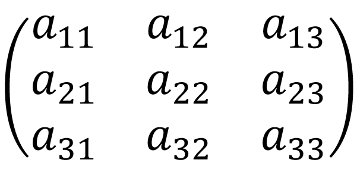
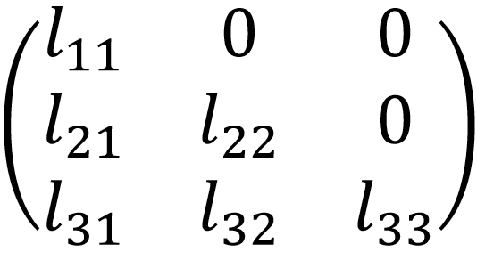
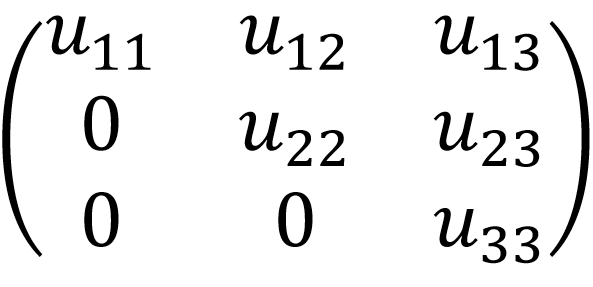

# MATLAB Project - Doolittle LU Factorization

## Overview

This repository contains a MATLAB project for **Doolittle LU Factorization**.  
The program is designed to solve linear systems of equations `A * x = b` using LU decomposition, breaking down the coefficient matrix into lower (`L`) and upper (`U`) triangular matrices.  
The project was developed as part of coursework in **Advanced Programming / Numerical Methods**.

The project implements:
- LU factorization using the **Doolittle method**  
- Forward and backward substitution to solve the system  
- Automated and manual creation of matrices and vectors  
- Calculation of computational cost (operations count)  
- Visualization of results for matrices `L`, `U`, vectors `y` and `x`  

---

## Repository Structure

```
main_repository/
│
├── images/
│   ├── matrix_A.png
│   ├── matrix_L.png
│   └── matrix_U.png
│
├── implementation/
│   ├── calcolo_costo_computazionale.m
│   ├── dati_input.m
│   ├── doolittle.m
│   ├── main_doolittle.m
│   ├── riempimento_automatico_matrice.m
│   ├── riempimento_automatico_vettore.m
│   ├── riempimento_manuale_matrice.m
│   └── riempimento_manuale_vettore.m
│
├── description.pdf
├── LICENSE
└── README.md
```

## Introduction
The MATLAB program implements the Doolittle LU factorization method. This is part of the LU factorization methods, where the matrix `A` of the system `A * x = b` is decomposed into the product of two matrices `L` and `U`, which are lower and upper triangular matrices, respectively.

- **Lower triangular matrix (L):** elements above the main diagonal are zero.  
  ```text
  For i < j, a_ij = 0
  ```
- **Upper triangular matrix (U):** elements below the main diagonal are zero.  
  ```text
  For i > j, a_ij = 0
  ```

Matrix `A` can therefore be written as:
```text
A = L * U
```

The system `A * x = b` can be rewritten as:
(L * U) * x = b  =>  L * (U * x) = b
By setting `U * x = y`, the system is solved in two steps:
1. `L * y = b` using forward substitution.
2. `U * x = y` using backward substitution.

---

## Doolittle Factorization Method

Given a 3x3 matrix A:



Lower triangular matrix L:



Upper triangular matrix U:



To reduce the unknowns from 12 to 9, we impose:

`l11 = l22 = l33 = 1`

This allows solving the system of 9 equations in 9 unknowns directly.

---

## Computational Cost
- **LU factorization:** about `n^3/3` operations.
- **Forward and backward substitution:** about `n^2` operations each.
- **Total:** `(n^3/3) + 2 n^2` operations.  
  For large `n`, the cost is approximately `n^3/3`.

---

## MATLAB Implementation
The project contains 8 `.m` files:

- **Main:** `main_doolittle.m` – runs the program.
- **Support functions (7):**
  1. `calcolo_costo_computazionale.m`
  2. `dati_input.m`
  3. `doolittle.m`
  4. `riempimento_automatico_matrice.m`
  5. `riempimento_automatico_vettore.m`
  6. `riempimento_manuale_matrice.m`
  7. `riempimento_manuale_vettore.m`

### Main (`main_doolittle.m`)
- Workspace cleanup: `clear all`, `close all`, `clc`
- Initialize intervals and maximum matrix order
- Display introductory message
- Call `dati_input` function
- Create matrices and vectors (manual/automatic)
- Display matrices A and b
- Call `doolittle` and `calcolo_costo_computazionale`
- Calculate and display absolute percentage error
- Remove temporary variables

### Main Functions
- **`calcolo_costo_computazionale`:** calculates expected number of operations.
- **`dati_input`:** handles user input for number of equations and creation mode.
- **`doolittle`:** performs LU factorization and solves the system.
- **`riempimento_automatico_matrice` & `riempimento_automatico_vettore`:** create random matrices and vectors.
- **`riempimento_manuale_matrice` & `riempimento_manuale_vettore`:** allow manual input of values.

---

## Usage
1. Open MATLAB and navigate to the project folder.
2. Run:
```matlab
main_doolittle
```
3. Follow the instructions to input matrices and vectors.
4. View results of 𝐿, 𝑈, 𝑦, and 𝑥.
